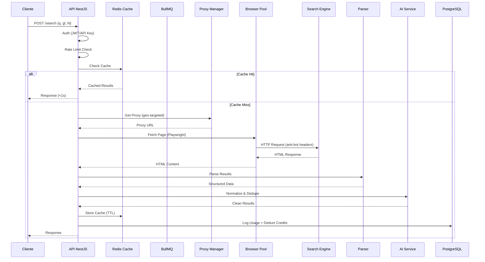
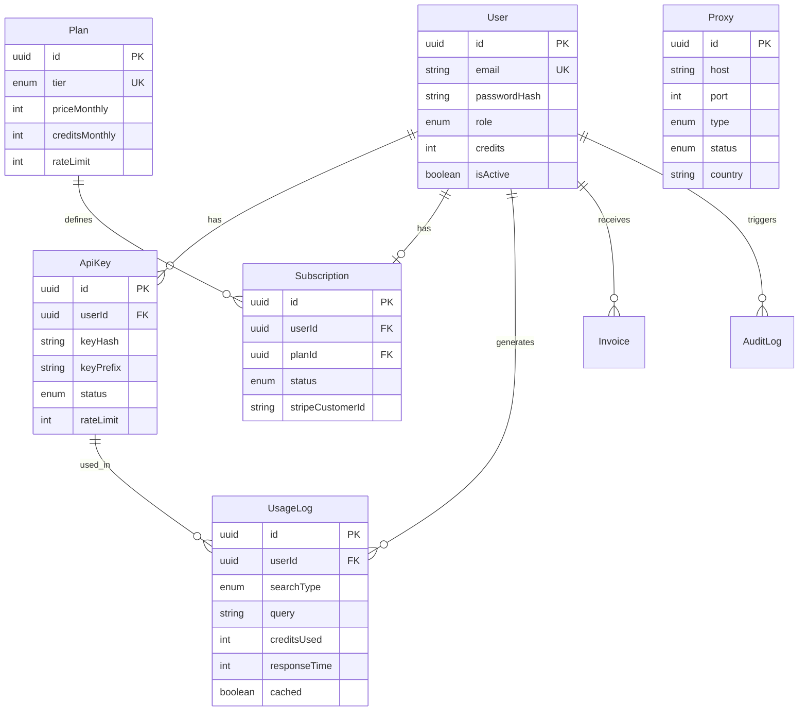

# Arquitetura — Serper Platform

## Visão Geral

Modular Monolith preparado para evolução em microserviços, seguindo Clean Architecture, DDD, SOLID, CQRS e Event-Driven patterns.

## Fluxo de Busca

## Modelo ER

## Anti-Bot Strategy

1. **User-Agent Rotation** — Pool de 5+ user agents reais
2. **Viewport Randomization** — Resoluções desktop e mobile variadas
3. **Headers Rotation** — Accept-Language, Accept, etc.
4. **Delay Inteligente** — 500-2000ms randomizado entre requests
5. **Session Pool** — Contextos Playwright reutilizáveis
6. **Captcha Detection** — Detecta reCAPTCHA e retry automático
7. **Backoff Exponencial** — 1s, 2s, 4s entre retries
8. **Proxy Rotation** — Residential/Datacenter/Mobile com failover

## Escalabilidade

- **Horizontal:** Kubernetes HPA (2-20 replicas)
- **Cache:** Redis cluster-ready
- **Queue:** BullMQ para batch/async processing
- **Database:** Connection pooling via Prisma
- **CDN:** Cloudflare-ready (Nginx reverse proxy)
