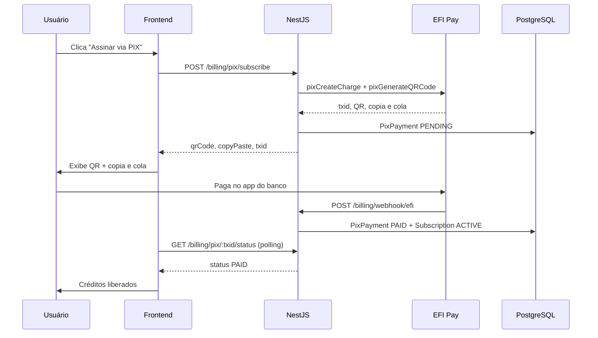

# Billing PIX (EFI Pay)

NoviqSearch usa **EFI Pay (Efí/Gerencianet)** como método principal de cobrança via PIX.

## Preços

| Produto | Valor | Créditos |
|---------|-------|----------|
| Teste Grátis | R$ 0 | 2.700 ao cadastrar |
| Plano Mensal (STARTER) | R$ 197/mês | 70.000/mês |
| Pacote avulso | R$ 5 | 500 |
| Overage (pay-as-you-go) | R$ 5 | a cada 500 créditos excedentes |

## Variáveis de ambiente

```env
EFI_CLIENT_ID=...
EFI_CLIENT_SECRET=...
EFI_PIX_KEY=sua-chave-pix@email.com
EFI_SANDBOX=true
EFI_CERTIFICATE_PATH=/path/to/certificado.p12
EFI_WEBHOOK_SECRET=          # opcional — valida header x-efi-signature
EFI_PIX_EXPIRATION_SECONDS=3600
CREDIT_PACK_PRICE_CENTS=500
CREDIT_PACK_CREDITS=500
OVERAGE_BLOCK_CREDITS=500
```

## Endpoints

| Método | Rota | Auth | Descrição |
|--------|------|------|-----------|
| POST | `/billing/pix/subscribe` | JWT | PIX R$197 — plano mensal |
| POST | `/billing/pix/buy-credits` | JWT | PIX R$5 × N pacotes de 500 créditos |
| POST | `/billing/pix/overage` | JWT | PIX overage pendente |
| GET | `/billing/pix/:txid/status` | JWT | Status + polling |
| POST | `/billing/webhook/efi` | Público | Confirmação EFI |
| GET | `/billing/profile` | JWT | Saldo, overage, PIX pendentes |
| PATCH | `/billing/pay-as-you-go` | JWT | Toggle pay-as-you-go |

## Fluxo end-to-end



### Dedução de créditos

1. Assinantes consomem primeiro a **franquia mensal** (70k).
2. Depois consomem **créditos avulsos** (campo `credits`).
3. Com **pay-as-you-go** ativo, excedente acumula em `overageCreditsPending`.
4. Ao atingir **500 créditos de overage**, novas requisições são bloqueadas até pagamento PIX.
5. `POST /billing/pix/overage` gera cobrança proporcional aos blocos de 500.

## Deploy na VPS

1. **Certificado EFI**: baixe o `.p12` no painel EFI e monte no container/servidor:
   ```bash
   EFI_CERTIFICATE_PATH=/app/certs/efi-producao.p12
   ```

2. **Webhook EFI**: configure no painel EFI a URL:
   ```
   https://api.noviqsearch.online/api/v1/billing/webhook/efi
   ```
   Use `EFI_WEBHOOK_SECRET` e envie no header `x-efi-signature` se desejar validação.

3. **Sandbox vs produção**:
   - Homologação: `EFI_SANDBOX=true` + credenciais de sandbox
   - Produção: `EFI_SANDBOX=false` + certificado de produção

4. **Migration**:
   ```bash
   npx prisma migrate deploy
   npm run prisma:seed
   ```

5. **Nginx**: garanta que a rota webhook aceita POST JSON (sem auth).

6. **Stripe**: permanece como fallback legado via `/billing/checkout`; PIX é o método principal no frontend.

## Modelo Prisma

- `PixPayment` — cobranças PIX (txid, QR, status, tipo)
- `User.payAsYouGoEnabled` — toggle overage
- `User.monthlyCreditsUsed` / `monthlyCreditsResetAt` — franquia mensal
- `User.overageCreditsPending` — overage acumulado
